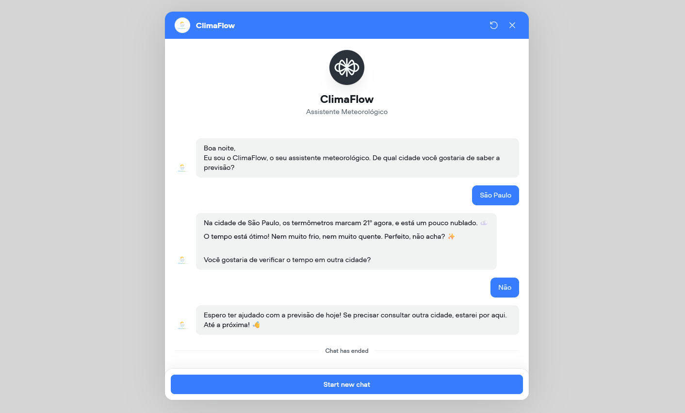
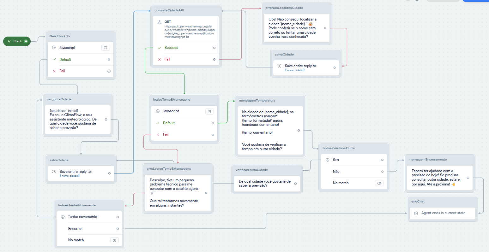

 

# 🌦️ ClimaFlow: Assistente Meteorológico Inteligente

O ClimaFlow é um chatbot de conversação desenvolvido no [Voiceflow](https://www.voiceflow.com/) que fornece previsões do tempo em tempo real. Este projeto foi criado para demonstrar a integração de APIs externas, manipulação de dados via JavaScript e design de experiência do usuário (UX) em ferramentas low-code.

## 🚀 Funcionalidades

- **Saudação Dinâmica:** Identifica o período do dia (manhã, tarde ou noite) para saudação.

- **Dados em Tempo Real:** Integração com a OpenWeather API para obter métricas precisas.

- **Lógica de Negócio Personalizada:**

  - Arredondamento de temperaturas (ex: 21.6°C para 22°C).

  - Conselhos contextuais baseados no clima (Dicas sobre casacos, hidratação ou uso de guarda-chuva).

  - Mensagens adaptáveis para condições climáticas e períodos do dia.

- **Tratamento de Erros (Error Handling):** Fluxos de contingência para cidades não encontradas ou falhas de conexão com a API.

# 🛠️ Tecnologias e Ferramentas

- **Voiceflow:** Plataforma principal para design do fluxo e lógica conversacional.

- **JavaScript:** Utilizado para manipulação de variáveis, tratamento de JSON e lógica condicional.

- **OpenWeather API:** Fonte de dados meteorológicos globais.

- **JSON:** Formato de troca de dados entre a API e o chatbot.

## 📐 Estrutura do Projeto (Arquitetura)

O bot segue uma estrutura lógica dividida em 4 fases principais:

- **Input & Contexto:** Coleta do nome da cidade e definição da saudação.

- **Integração:** Requisição GET para a API com tratamento de tokens de segurança.

- **Processamento:** Bloco de código JavaScript que limpa os dados brutos e define a "personalidade" da resposta baseada na temperatura e descrição.

- **Entrega & Retenção:** Resposta humanizada e botões de decisão para permitir novas consultas ou encerramento amigável.

## 💻 Como Visualizar

O projeto pode ser acessado diretamente através do GitHub Pages: 👉 https://raphaelsette.github.io/chatbot-climaflow-lowcode/

## 📸 Demonstração do Fluxo

