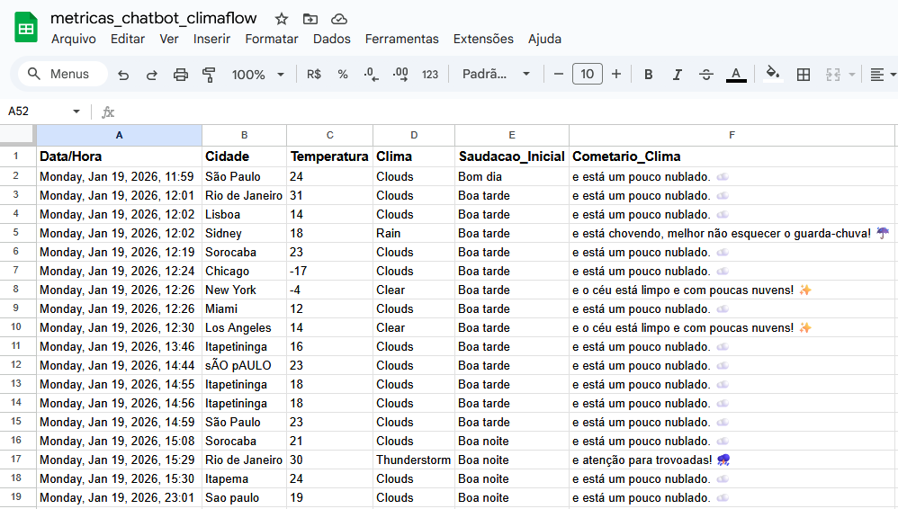

 

# 🌦️ ClimaFlow: Assistente Meteorológico

O ClimaFlow é um chatbot de conversação desenvolvido no [TybeBot](https://typebot.io/) que fornece previsões do tempo em tempo real. Este projeto foi criado para demonstrar a integração de APIs externas, manipulação de dados via JavaScript e design de experiência do usuário (UX) em ferramentas low-code.

Além disso, o assistente possui uma camada de persistência de dados através da integração com o Make e Google Sheets. Ao final de cada consulta bem-sucedida, o chatbot dispara um gatilho via Webhook que envia os dados meteorológicos processados. Esta automação permite o registo centralizado de métricas, facilitando a monitorização de utilização e a análise de performance do bot em tempo real.

## 🚀 Funcionalidades

- **Saudação Dinâmica:** Identifica o período do dia (manhã, tarde ou noite) para saudação.

- **Dados em Tempo Real:** Integração com a OpenWeather API para obter métricas precisas.

- **Lógica de Negócio Personalizada:**

  - Arredondamento de temperaturas (ex: 21.6°C para 22°C).

  - Conselhos contextuais baseados no clima (Dicas sobre casacos, hidratação ou uso de guarda-chuva).

  - Mensagens adaptáveis para condições climáticas e períodos do dia.

- **Registo de Métricas:** Integração com o Make (Integromat) e Google Sheets para salvar dados de cada consulta (cidade, temperatura, clima e timestamp) para análise de comportamento de mensagens e cidades mais pesquisadas.

- **Tratamento de Erros (Error Handling):** Fluxos de contingência para cidades não encontradas ou falhas de conexão com a API.

# 🛠️ Tecnologias e Ferramentas

- **Tybebot:** Plataforma principal para design do fluxo e lógica conversacional.

- **JavaScript:** Utilizado para manipulação de variáveis, tratamento de JSON e lógica condicional.

- **OpenWeather API:** Fonte de dados meteorológicos globais.

- **JSON:** Formato de troca de dados entre a API e o chatbot.

- **Make:** Automação para exportação de métricas.

- **Google Sheets:** Para persistência de dados.

- **HTML5/CSS3:** Interface web customizada com botões flutuantes para reporte de bugs.

## 📐 Estrutura do Projeto (Arquitetura)

O bot segue uma estrutura lógica dividida em 5 fases principais:

- **Input & Contexto:** Coleta do nome da cidade e definição da saudação.

- **Integração:** Requisição para a API da OpenWeather com tratamento de tokens de segurança.

- **Processamento:** Bloco de código JavaScript que limpa os dados brutos e define a "personalidade" da resposta baseada na temperatura e descrição.

- **Entrega & Retenção:** Resposta humanizada e botões de decisão para permitir novas consultas ou encerramento amigável.

- **Registo & Encerramento:** Envia métricas para o Make e Google Sheets e oferece opções de nova consulta ou saída.

## 💻 Como Visualizar

O projeto pode ser acessado diretamente através do GitHub Pages: 👉 https://raphaelsette.github.io/chatbot-climaflow-lowcode/

## 📸 Demonstração do Fluxo

**Interface do Chat** 

**Fluxo de Design no TypeBot** 

**Métricas para Análise** 

