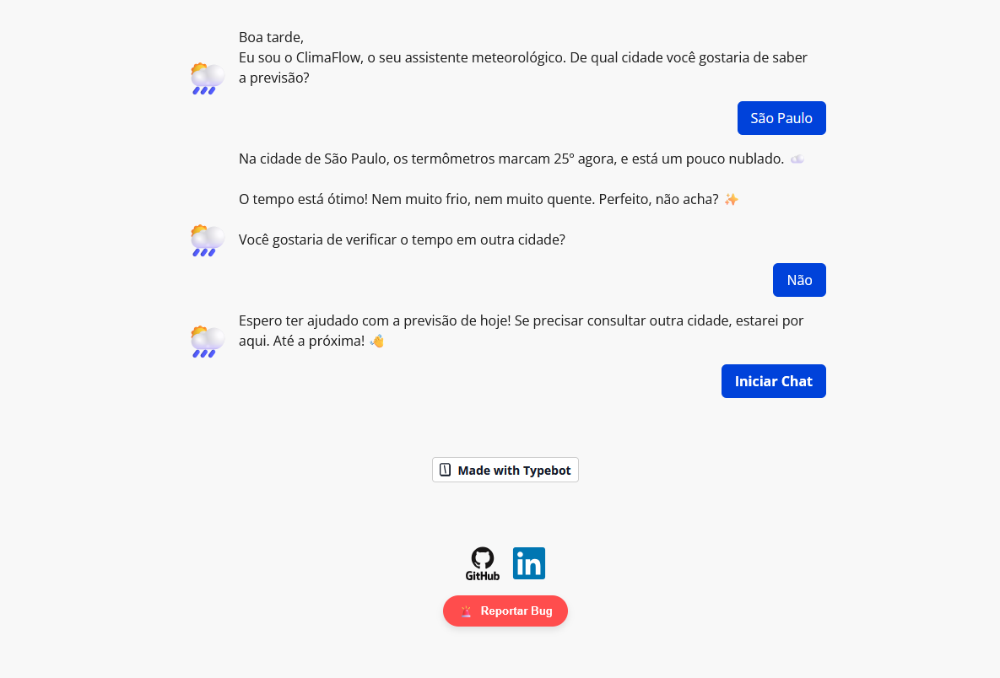
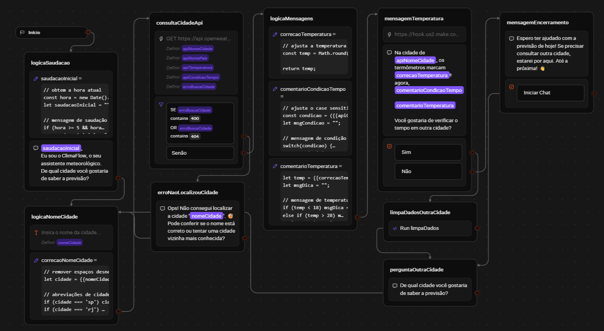
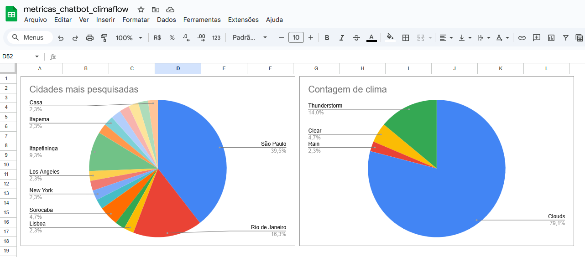
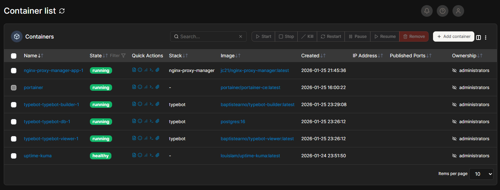
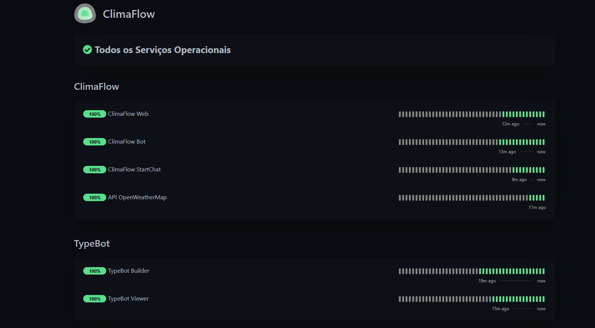

 

# 🌦️ ClimaFlow: Assistente Meteorológico

O ClimaFlow é um chatbot de conversação que fornece previsões do tempo em tempo real. Este projeto demonstra a convergência entre ferramentas low-code, desenvolvimento back-end e infraestrutura, abrangendo desde a lógica de conversação até uma arquitetura de deploy self-hosted.

Além de fornecer dados meteorológicos, o assistente possui uma camada de persistência de dados através da integração com Make e Google Sheets. Ao final de cada consulta, um gatilho via Webhook envia os dados processados para registro de métricas e análise de performance em tempo real.

## 🚀 Funcionalidades

- **Saudação Dinâmica:** Identifica o período do dia (manhã, tarde ou noite) para saudação.

- **Dados em Tempo Real:** Integração com a OpenWeather API para obter métricas precisas.

- **Lógica de Negócio Personalizada:**

  - Conselhos contextuais baseados no clima (Dicas sobre casacos, hidratação ou uso de guarda-chuva).

  - Mensagens adaptáveis para condições climáticas e períodos do dia.

- **Registo de Métricas:** Integração com o Make (Integromat) e Google Sheets para salvar dados de cada consulta para análise de comportamento de mensagens e cidades mais pesquisadas.

- **Tratamento de Erros (Error Handling):** Fluxos de contingência para cidades não encontradas ou falhas de conexão com a API.

# 🛠️ Tecnologias e Ferramentas

- **Desenvolvimento e Lógica**

  - Typebot: Plataforma principal para design do fluxo e lógica conversacional.

  - JavaScript: Utilizado para manipulação de variáveis, tratamento de JSON e lógica condicional.
    
  - OpenWeather API: Fonte de dados meteorológicos globais.
    
  - Make: Automação para exportação de métricas.
  
  - Google Sheets: Para persistência de dados.

- **Arquitetura Cloud & Containerização**

  - Self-Hosted Cloud: Deploy realizado em instância Cloud.

  - Docker & Portainer: Utilizados para orquestração e gerenciamento ágil de containers.

  
- **Networking & Segurança**

  - Cloudflare: Camada de proteção e gerenciamento de DNS para o domínio personalizado.

  - Nginx Proxy Manager: Configuração de Proxy Reverso para gerenciamento de tráfego.

- **Observabilidade**

  - Uptime Kuma: Monitoramento 24/7 da saúde dos serviços e notificações de status.

## 📐 Estrutura do Projeto (Arquitetura)

O bot segue uma estrutura lógica dividida em 5 fases principais:

- **Input & Contexto:** Coleta do nome da cidade e definição da saudação.

- **Integração:** Requisição para a API da OpenWeather com tratamento de tokens de segurança.

- **Processamento:** Bloco de código JavaScript que limpa os dados brutos e define a "personalidade" da resposta baseada na temperatura e descrição.

- **Entrega & Retenção:** Resposta humanizada e botões de decisão para permitir novas consultas ou encerramento amigável.

- **Registo & Encerramento:** Envia métricas para o Make e Google Sheets e oferece opções de nova consulta ou saída.

## 💻 Como Visualizar

O projeto pode ser acessado diretamente através do GitHub Pages: 👉 https://climaflow.settebyte.com/

## 📸 Demonstração do Fluxo

**Chat** 

**Fluxo** 

**Métricas** 

**Portainer** 

**Status Page** 

